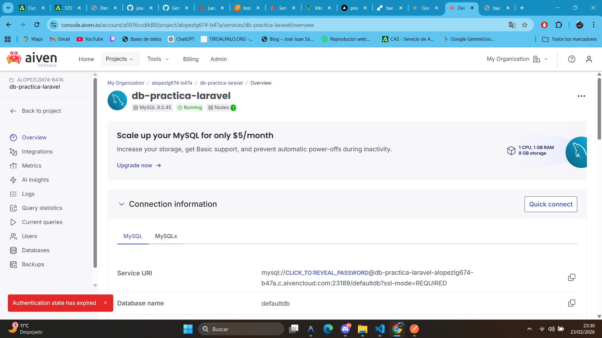
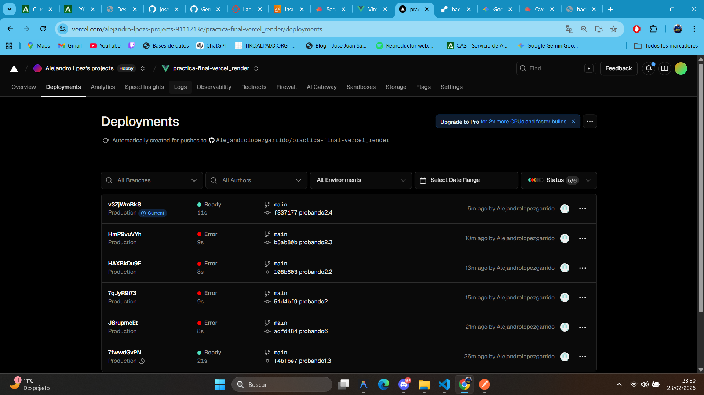
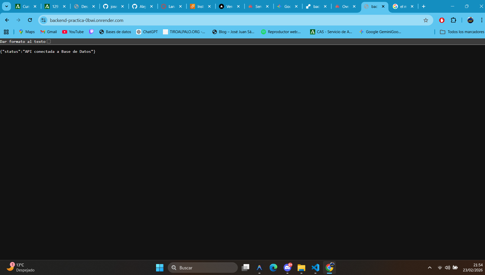
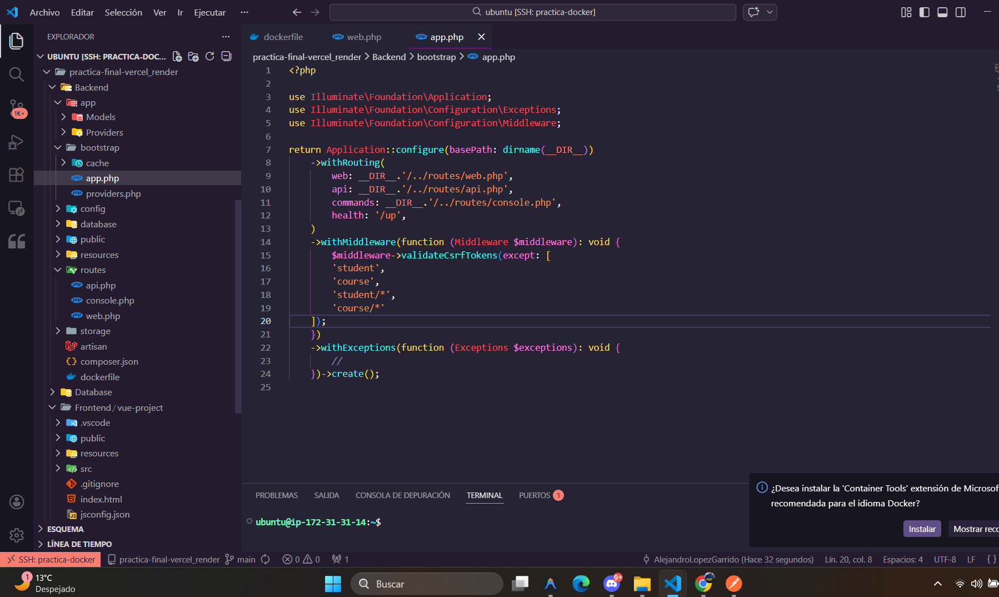
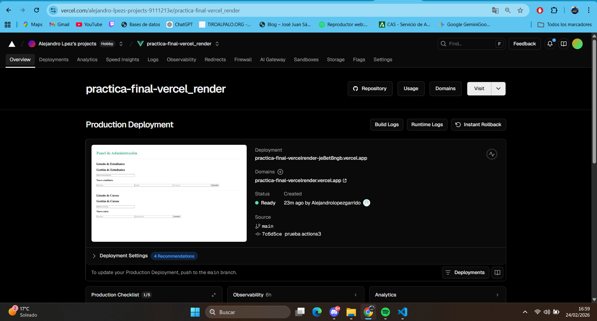
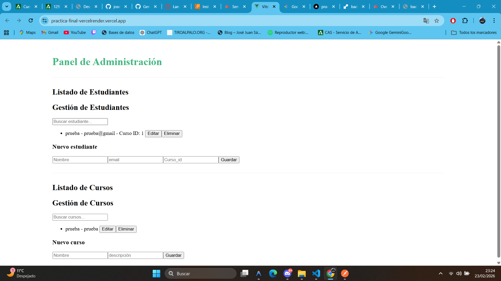
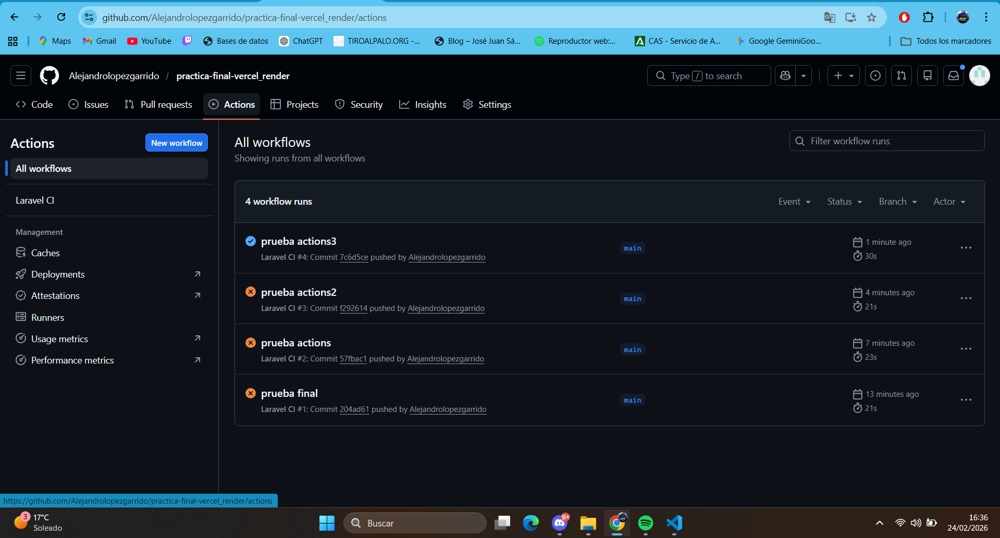

# 🚀 Proyecto Full-Stack: Sistema de Gestión de Estudiantes y Cursos

Este proyecto es una aplicación web completa que permite la gestión administrativa de alumnos y sus respectivos cursos. La arquitectura ha sido diseñada separando el frontend, el backend y la base de datos en diferentes servicios usando render, vercel y Aiven.

## 🏗️ Arquitectura del Sistema

La aplicación se apoya en tres pilares fundamentales para garantizar su funcionamiento online:

* **Frontend (Vue.js 3):** Desplegado en **Vercel**. Es una Single Page Application (SPA) que gestiona la interfaz y la lógica de usuario.
* **Backend (Laravel 11):** Desplegado en **Render**. Funciona como una API RESTful que procesa las peticiones y se comunica con la base de datos.
* **Base de Datos (MySQL):** Alojada en **Aiven**. Una base de datos gestionada que asegura que los datos persistan independientemente del estado de los servidores.

## 🛠️ Stack Tecnológico

* **Frontend:** Vue.js 3 (Options API), Vite.
* **Backend:** PHP 8.x, Framework Laravel 11.
* **Base de Datos:** MySQL 8.0 (vía Aiven).
* **Despliegue e Infraestructura:** Vercel (Frontend CI/CD), Render (Backend), GitHub (Control de versiones).

## 📝 Proceso de Implementación y Despliegue

### 1. Preparación de la Base de Datos
* Se configuró una instancia de MySQL en **Aiven**.
* Se vincularon las credenciales mediante variables de entorno para una conexión segura desde el backend.

### 2. Configuración del Backend (Render)
* Se usaron las variables de entorno que nos dio Aiven al configurar la Base de Datos
* Se crearon los modelos, controladores y migraciones para las entidades `Student` y `Course`.
* Se ajustó el archivo `config/cors.php` para permitir el acceso desde el dominio de producción de Vercel.
* Se realizó el despliegue automático conectando el repositorio de GitHub a **Render**.

### 3. Desarrollo del Frontend (Vercel)
* Con la parte de Render ya funcional cogi el repositorio de GitHub
* Se implementaron componentes reactivos para el listado y CRUD de datos.
* Se configuró el **Root Directory** en Vercel apuntando a `Frontend/vue-project`.
* Se corrigieron las rutas de importación de componentes para asegurar la compatibilidad con el entorno de compilación de Vercel.

## 🚀 Acceso al Proyecto

* **URL del Frontend:** [https://practica-final-vercelrender.vercel.app](https://practica-final-vercelrender.vercel.app)

> **Nota Importante:** Debido al uso de la capa gratuita de **Render**, el servidor entra en reposo tras periodos de inactividad. La primera carga de datos puede demorar unos **50 segundos** mientras la instancia se reactiva.


## Contenido Dockerfile
```
FROM php:8.2-apache

RUN apt-get update && apt-get install -y libpng-dev libonig-dev libxml2-dev libzip-dev zip unzip git curl
RUN docker-php-ext-install pdo_mysql mbstring exif pcntl bcmath gd zip

RUN a2enmod rewrite
ENV APACHE_DOCUMENT_ROOT /var/www/html/public

RUN sed -ri -e 's!/var/www/html!/var/www/html/public!g' /etc/apache2/sites-available/000-default.conf
RUN sed -ri -e 's!/var/www/!/var/www/html/public!g' /etc/apache2/apache2.conf

RUN echo "<Directory /var/www/html/public>\n\tAllowOverride All\n\tRequire all granted\n</Directory>" >> /etc/apache2/apache2.conf

RUN curl -sS https://getcomposer.org/installer | php -- --install-dir=/usr/local/bin --filename=composer

COPY . /var/www/html

RUN mkdir -p /var/www/html/storage /var/www/html/bootstrap/cache
RUN chown -R www-data:www-data /var/www/html/storage /var/www/html/bootstrap/cache
RUN chmod -R 775 /var/www/html/storage /var/www/html/bootstrap/cache

ENV APP_KEY=base64:u6899S79392Z6pY766S/YpI9pX2U56699S79392Z6pY=

RUN composer install --no-dev --optimize-autoloader --no-scripts

CMD php artisan migrate --force && apache2-foreground

EXPOSE 80
```


## Imágenes del proceso
### Base de datos


### El Deploy de render funcionando


### Comporbar que render funciona antes de enganchar vercel


### Añadimos los middleware


### Vista vercel funcionando


### Aplicacion Funcionando


### El gitHub actions funcionando correctamente

---
**Desarrollado por:** Alejandro López Garrido 2º DAW